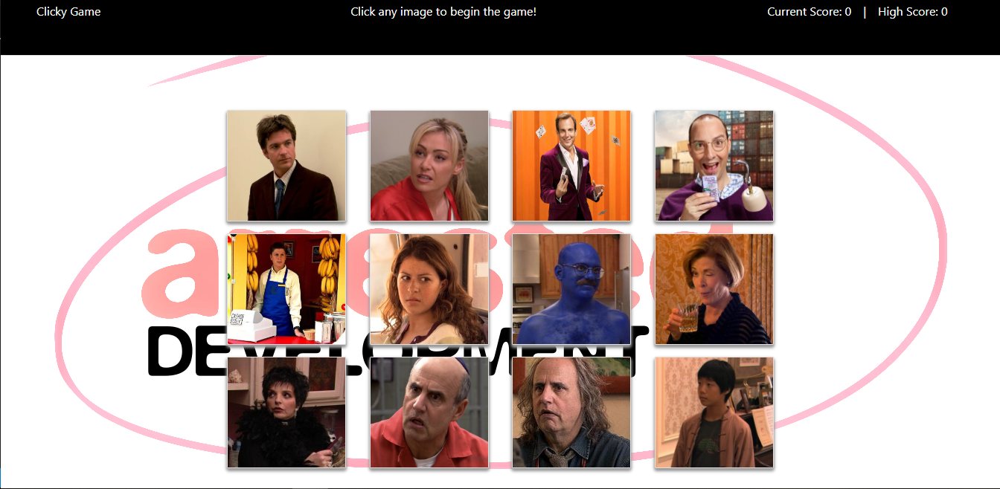

# clicky-game

This is an on-line app that allows users play a game by clicking on the images on the screen.

Once an image is clicked, it cannot be clicked again or the game will end.  To add to the challenge, the images shuffle each time one is clicked.

## Getting Started
To visit the site, click [here](https://click-game-01.herokuapp.com/). 

## Prerequisites
Google Chrome or Safari is recommended for running this program.  If the user has pulled the app from the GitHub repository, please remember to `yarn install` in the terminal before running the app.

## Challenges
When recording the high score, there were some issues with determining the best way to save the high score.  Based on what was learned and used during class activities, a ternary conditional operator was used. The first time around the score would set to zero unexpectedly, but after a few corrections the high score will now set and remain the highest played score each time the app is started.

## Built With
* React.js
* Bootstrap
* There was no database set up for this app

## Authors
Valerie Flores - Initial work

## License
This project is licensed under the MIT License - see the LICENSE.md file for details

## Acknowledgments
Thank you to UCI Coding Bootcamp classmates for your help and suggestions, and the many examples of other coders online.